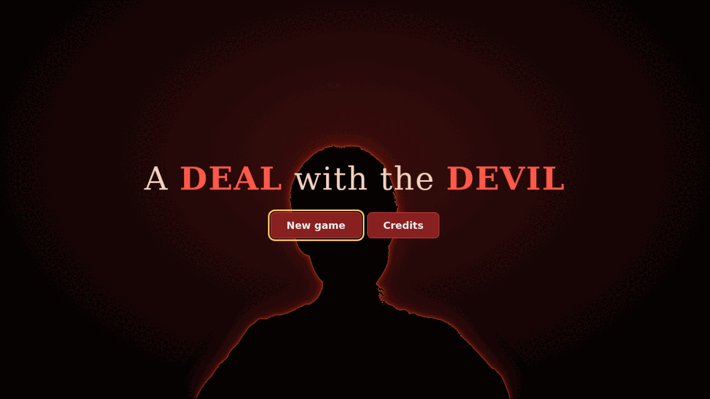
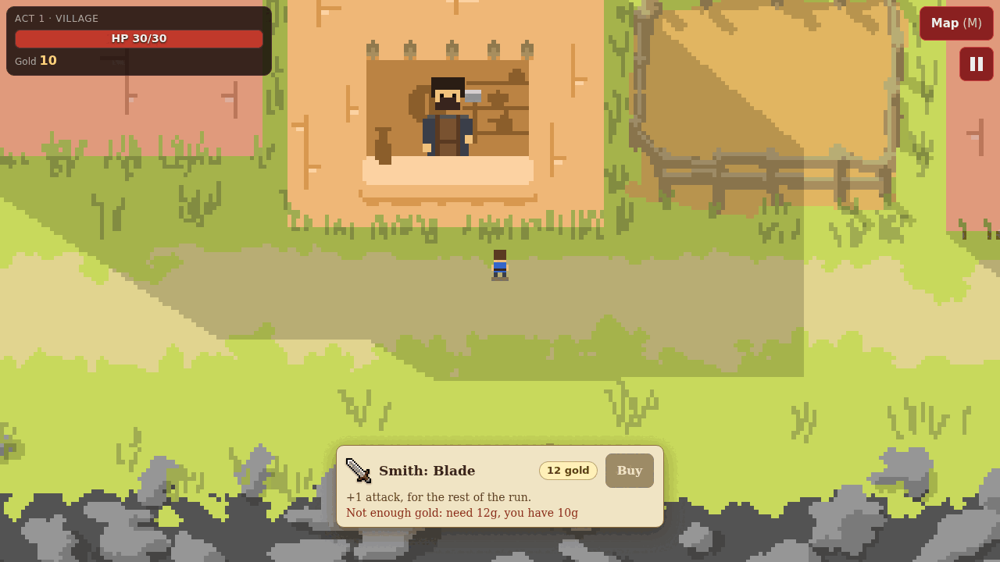
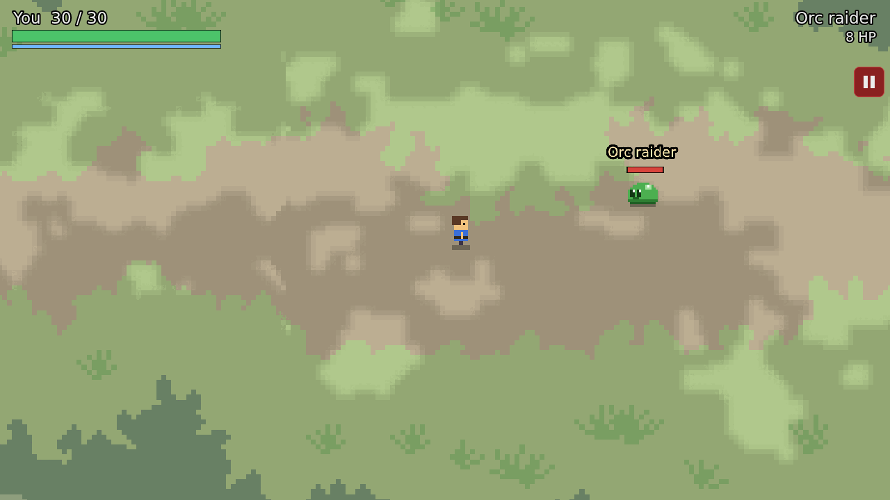
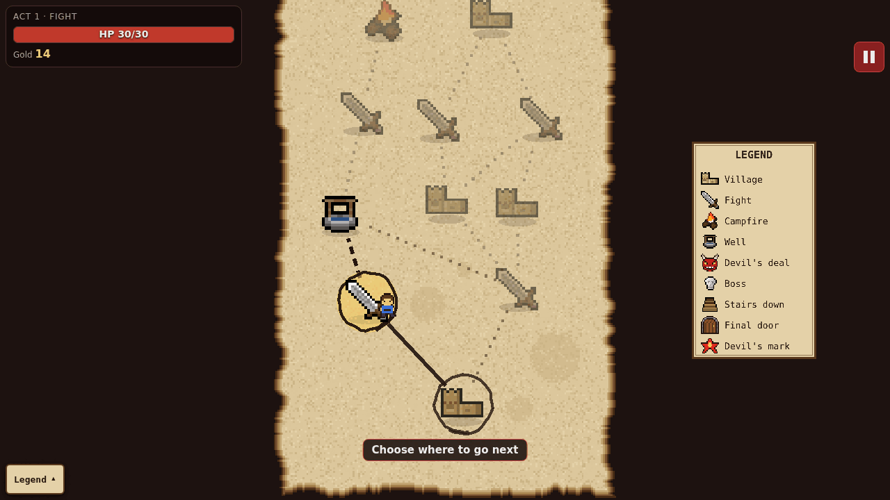
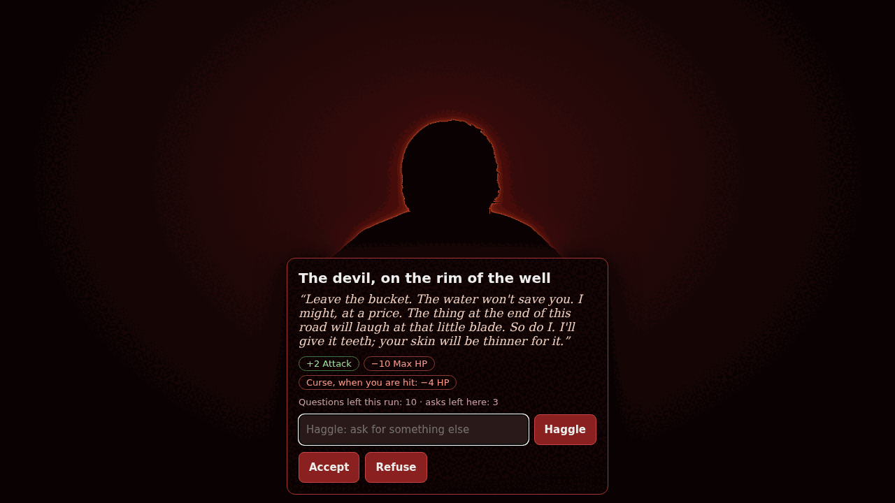
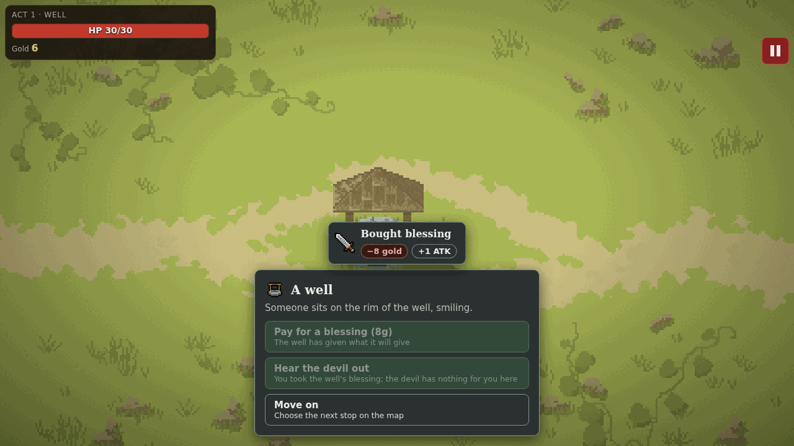
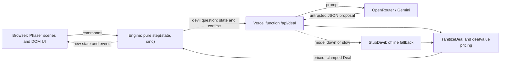

<div align="center">

# A DEAL with the DEVIL

**A roguelite where an AI devil makes you offers, and he cheats.**

### [Play now: a-deal-with-the-devil.vercel.app](https://a-deal-with-the-devil.vercel.app)


</div>

## About

Every deal-with-the-devil story is a negotiation with someone smarter than you. LLMs are usually the opposite: endlessly agreeable. So we built a devil that is *trying to beat you*.

A run is three acts. You pick your route on a Slay-the-Spire style map: villages with shops, realtime sword fights on forest paths (orcs, demon minibosses, a warrior final boss), campfires, wells and the devil's own deal nodes. He turns up at campfires and wells too, opens with an offer aimed at your weakest stat, and you haggle in plain English. His deals carry hidden curses, rewrite the map ahead of you, or cost your soul. Try to jailbreak him and he strikes. You get 10 questions per run, one revive at death's door (it costs your soul), and three endings: win, hell or lose.

What makes him different: **he proposes, the engine decides.** The model only writes a proposal. Our server prices it against you, rolls the dice for his strikes, and clamps every number before the game accepts anything. He can break your run, never the game.

## Screenshots

<table>
  <tr>
    <td align="center"><br><sub>The title screen</sub></td>
    <td align="center"><br><sub>The village: walk up to a stall and buy</sub></td>
    <td align="center"><br><sub>A realtime fight on the forest path</sub></td>
  </tr>
  <tr>
    <td align="center"><br><sub>The act map, forced once a node is done</sub></td>
    <td align="center"><br><sub>The devil at the well, with an offer on the table</sub></td>
    <td align="center"><br><sub>Notices show what a choice cost and gave</sub></td>
  </tr>
</table>

The character sprites in these shots are the generated placeholders (a slime stands in for the orc). The real sprite packs are licensed and shipped encrypted; they show in builds that have the `ASSET_KEY`.

## How to play

| | Keyboard and mouse | Touch |
| --- | --- | --- |
| Move | `WASD` or arrow keys | drag the stick |
| Attack (fights) | `Space` or left click | Attack button |
| Dash (fights) | `Shift` | Dash button |
| Map (village) | `M` | Map button, top right |
| Buy at a stall | `E` or `Enter` | Buy button |
| Pause | `Esc` or `P` | pause button, top right |

Win fights for gold, spend it in villages, rest or sharpen your blade at campfires, and decide whether the devil's latest offer is worth it. After a fight, campfire or well the map opens and you must pick the next stop.

## Architecture at a glance



The engine runs in the browser and holds the whole run as one JSON `GameState`. The function only ever returns a proposal, and the engine clamps it again (`sanitizeDeal`) before it touches the run.

## Engineering decisions and trade-offs

- **The model proposes, the engine decides.** LLM output is untrusted input, like a form field. The server prices every offer so it is never good for the player (`dealValue`, in HP-equivalents), clamps each number, and rolls the strike dice itself, because models do not randomise: asked to strike "about half the time", gemma4:26b struck 92% of the time. Cost: the devil is less free than a raw model. Gain: no prompt can mint gold.
- **A stateless, deterministic engine.** `step(state, command)` is pure and seeded, so any run replays exactly. A frozen JSON contract test (additive changes only) and equivalence fixtures (700 recorded runs: 500 bot, 200 chaos) fail on any accidental rule change. Cost: an intentional balance change means regenerating fixtures.
- **A red-team suite.** 75 attack texts in 14 families (51 hostile) and hostile model replies go through the engine and the sanitizer: no crash, no soul taken without consent, every limit held. The corpus can be pointed at any backend devil.
- **Graceful degradation.** A slow, junk or failed model reply becomes the offline `StubDevil`'s answer; with no `OAI_BASE_URL` set, the stub answers straight away. The run goes on. Trade-off: the stub is canned, so the devil gets duller, not broken.
- **Balance by simulation.** Scripted bots played 100k+ simulated runs before we argued about numbers; the target for a plain player is about 50% clean wins. The bots play the round-based fight, so realtime feel is not covered by those numbers.
- **Licensed art encrypted at rest.** Packs we may use but not redistribute live in the repo as AES-256-GCM files and are decrypted at build time with `ASSET_KEY`. Without the key the game uses generated art, and a test checks that the key never reaches the built game.

### Numbers you can check

| Claim | Number | How to verify |
| --- | --- | --- |
| Automated tests | 387 passing, network-free | `npm test` |
| Engine replays | 700 recorded runs (500 bot, 200 chaos) | `src/game/equivalence.test.ts` |
| Red-team texts | 75 in 14 families, 51 hostile | `src/game/__fixtures__/redteam.ts`, `src/game/devilRedteam.test.ts` |
| Hostile model replies | 35, none crash the game | `src/game/devilRedteam.test.ts`, `src/game/oaiDevil.test.ts` [check: exact count] |
| Per-deal clamps | HP +/-25, max HP +/-10, gold up to +30, attack +/-3, soul +/-1; a strike takes at most 8 HP | `src/game/state.ts`, `src/game/deal.ts` |
| Devil latency | about 3 s per reply on gemini-2.5-flash [check: team measurement, not in the repo]; local gemma4:26b about 2.0 s median | `docs/pitch/QA.md`; the client waits up to 15 s |
| Bundle size | 1.4 MB JS (390 KB gzip), Phaser included | `npm run build` |
| Devil budget | 10 questions per run, 3 asks per node, 5 curses held | `docs/devil-api.md` |

## Where to look

| If you want | Open |
| --- | --- |
| The rules as one pure function | [`src/game/state-machine.ts`](src/game/state-machine.ts) |
| The deal type and the clamp | [`src/game/deal.ts`](src/game/deal.ts) |
| How offers are scored | [`src/game/dealValue.ts`](src/game/dealValue.ts) |
| The LLM devil: prompts, server-side strikes, pricing, fallback | [`server/devil-core.ts`](server/devil-core.ts) |
| The deployed endpoint | [`api/deal.ts`](api/deal.ts) |
| The frozen JSON contract test | [`src/game/contract.test.ts`](src/game/contract.test.ts) |
| The equivalence fixtures | [`src/game/equivalence.test.ts`](src/game/equivalence.test.ts) |
| The red-team test and its corpus | [`src/game/devilRedteam.test.ts`](src/game/devilRedteam.test.ts), [`redteam.ts`](src/game/__fixtures__/redteam.ts) |
| The architecture and a "change X, edit Y" table | [`docs/OVERVIEW.md`](docs/OVERVIEW.md) |

## Tech, in brief

TypeScript, Vite and Phaser 3 (the only runtime dependency). The engine is stateless behind a frozen JSON contract, so the UI, the tests, the bots and the devil all speak the same language. The LLM devil is an HTTP endpoint over any OpenAI-compatible API: OpenRouter with `google/gemini-2.5-flash` in production, a local Gemma model in development. Pricing, strikes and sanitising happen server-side, with the stub as the fallback. Art is the designer's own plus licensed sprite packs, stored AES-encrypted. 387 tests. More in [docs/OVERVIEW.md](docs/OVERVIEW.md).

## What we'd do next

- **Rate limiting on `/api/deal`.** Today it only caps the body at 512 KB, and the engine caps questions per run. A public endpoint needs per-IP limits.
- **Caching and cost control.** Measure tokens and price per run, cache the free opening offers by game state, and set a budget alarm.
- **Observability.** The devil logs latency, path and source per call in dev. Production needs the same as metrics, with a stub-fallback rate.
- **An eval harness for prompts.** Turn the red-team corpus and the pricing checks into a scored run for every prompt or model change, and run it on Gemini (the measured results so far are from local models).
- **The game:** a voiced devil, permanent contracts across a run, more enemies and scenes, music.

## Run it locally

```bash
npm ci
npm run game     # the game, with test tools (?seed=abc, ?god=1)
npm test         # all unit tests, network-free
```

Put `ASSET_KEY` in `.env` to see the real sprites ([docs/assets.md](docs/assets.md)); without it the placeholders show. To run your own devil on Vercel, see [docs/deploy-vercel.md](docs/deploy-vercel.md). Every command, page and lab is in [docs/DEVELOPING.md](docs/DEVELOPING.md).

## Team

Built at StormHacks 2026 by team Spin 2 Win.

| Who | Role |
| --- | --- |
| Kirstin Horvat ([kbph05](https://github.com/kbph05)) | Programming and development: backend and the devil |
| Terrace Hung ([terraceonhigh](https://github.com/terraceonhigh)) | Programming and development: pitch and deploy |
| Armand Baril (Big Chungus) | Design and art |
| legilles | |

## Credits

Scene art (devil, forest, well, village) by Armand Baril. Character sprites: Tiny RPG Character Asset Packs 01 and 02 by Zerie, and Warrior Character Animation by Corwin, all from itch.io. Full list: [docs/CREDITS.md](docs/CREDITS.md).
