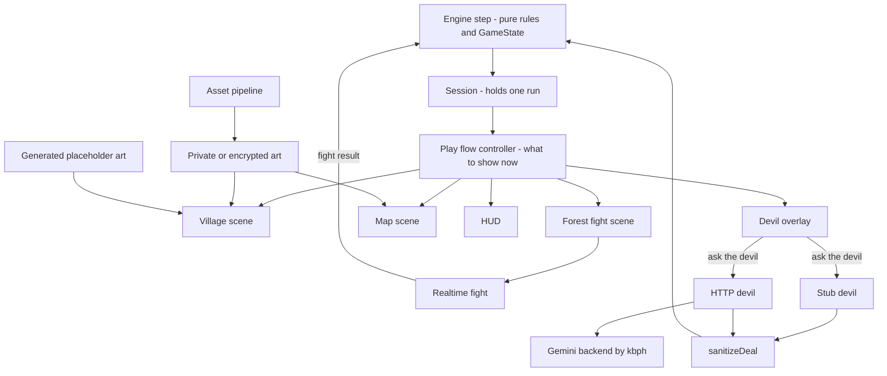

# Overview: how the pieces fit

Start here. This page says what runs where, how the code is split, and which file to edit for which change. It links the deeper docs instead of repeating them.

Writing code with an AI assistant? Give it this page first. Then name the row of section 3 that matches your change.

## 1. What runs where

**The game is `play.html`, started with `npm run game`.** It is in test builds only for now. The final build entry is still `index.html` (the plain DOM front end in `src/ui/`). [play.md](play.md), "Making it the main build", says how to swap them.

| Command or page | What it is | Entry file |
| --- | --- | --- |
| `npm run game` (`/play.html`) | **The game**: village, forest fights, map, HUD, devil overlay, ending card. | `src/play/play.ts` |
| `npm run dev` (`/index.html`) | Old DOM front end plus dev tools (Devil lab, autoplay, F12 console). Also the **final build entry**. | `src/main.ts` |
| `npm run world` (`/world.html`) | World lab: the village or forest scene on its own. | `src/world/dev.ts` |
| `/fight.html` | Fight lab: the realtime fight on its own. | `src/fight/dev.ts` |
| `npm run map` (`/map.html`) | Map lab: the act map on a real engine run. | `src/mapscene/dev.ts` |
| `/hud.html` | HUD lab: the HUD with buttons that step a real run. | `src/hud/dev.ts` |
| `npm run build` | **Final build** into `dist/`: `index.html` only, no labs, no dev tools. | `index.html` |
| `npm run build:test` / `npm run build:game` | Test build into `dist-test/`: all pages, including the game. | `vite.config.ts` |
| `npm run preview` / `preview:test` / `preview:game` | Serve a finished build. `preview:game` opens `/play.html`. | none |
| `npm run mock:devil` | Fake devil backend on `localhost:8787/deal`. | `scripts/mock-devil-server.ts` |
| `npm run devil:oai` | The LLM devil on `localhost:8788/deal`, over any OpenAI-compatible API (llama-swap by default, or Gemini). See [devil-api.md](devil-api.md). | `scripts/oai-devil.ts` |
| `npm test` | All unit tests. | `src/**/*.test.ts`, `tools/*.test.ts` |
| `npm run fixtures` | Re-record the engine fixtures. Rare. See section 4. | `src/game/__fixtures__/generate.ts` |
| `npm run play` | **Not the game.** A terminal REPL for the engine (`play -- --json` for machine use). | `src/game/repl.ts` |
| `npm run assets:keygen` / `encrypt` / `check` / `decrypt` | Encrypted art tools. See [assets.md](assets.md). | `tools/assets.ts` |

Add `?seed=abc` to any page for a fixed run. `?god=1` on the game gives huge HP in fights (test builds only).

## 2. The architecture in one picture

The rules live in one pure function. Everything else is a screen on top of it.



How to read it:

- **Engine** (`src/game/`): `step(state, cmd)` in `state-machine.ts` takes the whole run as one JSON `GameState` and returns the next one, plus events and the legal next actions. No screens, no network. See [engine.md](engine.md).
- **Session** (`src/game/session.ts`): holds the current run. Every screen sends commands through it.
- **Play flow** (`src/play/flow.ts`): a pure function, `flow(view, local)`. It decides which screen and which prompts to show, and when the map is open or forced. `src/play/play.ts` draws the result. See [play.md](play.md).
- **Scenes**: village and forest are JSON files (`src/world/scenes/`) drawn by `src/world/`. The map is `src/mapscene/` ([mapscene.md](mapscene.md)). The HUD is `src/hud/` ([hud.md](hud.md)). The fight is `src/fight/` ([fight.md](fight.md)); it reports back a result that the engine clamps (`sanitizeFightResult`).
- **Devil**: the engine asks, a backend answers. `StubDevil` (`src/game/devil.ts`) is canned and offline. `HttpDevil` (`src/game/httpDevil.ts`) calls the backend described in [devil-api.md](devil-api.md). Every answer goes through `sanitizeDeal` before it touches the run.
- **Art**: the designer's art is in `assets/` at the repo root, imported through Vite: the devil's poses (`src/play/devilArt.ts`, [play.md](play.md)) and the forest band (`src/world/bandArt.ts`, [world.md](world.md)). The licensed sprite packs (encrypted, served only with `ASSET_KEY`) draw the player and the enemies: Soldier, Orc, Demon_A for the minibosses, WarriorCh for the final boss (`src/render/sprites.ts`, [fight.md](fight.md) "Sprites", [CREDITS.md](CREDITS.md)). Everything else is placeholders drawn in code, and without the key the sprites fall back to them too. Private art in the gitignored `public/assets/private/` replaces them automatically. See [assets.md](assets.md) and [world.md](world.md).
- **Map generator** (`src/map/`): makes each act from the seed. See `src/map/README.md`.
- **Dead code**: `src/scenes/MapScene.ts` is an old Phaser map. Nothing imports it.

## 3. I want to change X, edit Y

Names in backticks are constants or functions you can search for. "Inline" means there is no constant, so edit the number in place.

| # | I want to change | Edit this |
| --- | --- | --- |
| 1 | Shop prices | `WARES` in `src/game/gameState.ts` |
| 2 | What a ware does (heal 12, blade +1, blessing roll) | `buy()` in `src/game/state-machine.ts`. Also update the text copies: `WARE_INFO` in `src/hud/model.ts` and `WARE_TEXT` in `src/world/shopZone.ts` |
| 3 | Gold from a won fight | Inline in `src/game/state-machine.ts`, twice: `fight()` and `fightResult()`. Change both |
| 4 | Engine enemy HP and power per act | Inline in `enter()` in `src/game/state-machine.ts` (regular and boss) |
| 5 | Enemy and boss names | `FOES` and `BOSSES` in `src/game/gameState.ts` |
| 6 | Realtime enemy stats (speed, cooldowns, aggro) | `ENEMIES` in `src/fight/enemies.ts` |
| 7 | Enemy mix and scaling up the run | `ENCOUNTER_BANDS` and `SCALING` in `src/fight/encounters.ts` |
| 8 | Map odds, size, width | `DEAL_NODE_RATE`, `MIN_NODES`, `MAX_NODES`, `MAX_WIDTH`, `START_KIND` in `src/map/mapgen.ts` |
| 9 | Which kinds exist, and good vs bad | `GOOD_KINDS`, `BAD_KINDS` in `src/map/types.ts` |
| 10 | Campfire rules (rest heals 40%, train +1) | Rest is inline (`maxHp * 0.4`, case `"rest"` in `step`). Train is `TRAIN_ATTACK` in `src/game/gameState.ts` |
| 11 | Well rules (blessing, one choice, devil chance) | `WELL_DEVIL_CHANCE`, `ONE_CHOICE` in `src/game/gameState.ts`. Blessing outcomes are inline in `buy()` |
| 12 | Healing on stairs and after a boss | Inline `healBy` calls in `go()`, `fight()` and `fightResult()` in `src/game/state-machine.ts` |
| 13 | Starting stats | `newPlayer` in `src/game/state.ts` |
| 14 | Hard limits on stats and deal sizes | `STAT_RANGE`, `DELTA_RANGE` in `src/game/state.ts`; `MAX_STRIKE_HP` in `src/game/deal.ts` |
| 15 | Questions per node, per run, curses held | `MAX_ASKS`, `MAX_DEVIL_QUERIES`, `MAX_CURSES` in `src/game/gameState.ts` |
| 16 | Stub devil offers and wording | `OFFERS` in `src/game/devil.ts` |
| 17 | Stub devil opening offer | `openingOffer`, `OPENER_LOW_HP`, `OPENER_POOR` in `src/game/devil.ts` |
| 18 | Stub devil anger and strikes | `ANGRY`, `STRIKE_LINES`, `STRIKE_CHANCE`, `OFF_TOPIC_STRIKE_CHANCE` in `src/game/devil.ts` |
| 19 | Devil lines at wells | `WELL_ENTICE` in `src/game/devil.ts` |
| 20 | Gemini devil wording and offers | Your backend, not this repo. Seed prompt: `devil_prompt.txt`. Contract: [devil-api.md](devil-api.md). See section 5 |
| 21 | Village and forest layout (stalls, exits, bounds, spawns) | `src/world/scenes/village.json`, `src/world/scenes/forest.json`. Shape: `SceneDef` in `src/world/scene.ts`; [world.md](world.md) |
| 22 | Which scenes exist | `SCENES` in `src/world/scenes/index.ts` |
| 23 | Replace art (backgrounds, overlays, player, map icons). The team's own art: the PNGs in `assets/` (devil poses, forest band; same names) | Drop files in the gitignored `public/assets/private/`: `scenes/<id>/background.png`, `player-idle.png`, `player-walk.png`, `map/<kind>.png`. Sheet spec: `PRIVATE_PLAYER` in `src/world/assets.ts`. See [assets.md](assets.md) |
| 24 | Share licensed art with the team | Encrypted pipeline: `npm run assets:encrypt`, key `ASSET_KEY` in `.env`. Code: `tools/assets.ts`, `tools/vite-plugin-encrypted-assets.ts` |
| 25 | HUD fields and layout | `hudModel` and `HudModel` in `src/hud/model.ts`; drawing in `src/hud/hud.ts`; looks in `src/hud/hud.css` |
| 26 | Map icons (pixel art) and legend words | `ICONS` in `src/mapscene/icons.ts`; `LEGEND` in `src/mapscene/MapScene.ts` |
| 27 | Map screen layout | `LAYOUT`, `MAP_WIDTH`, `layoutMap` in `src/mapscene/layout.ts` |
| 28 | The sword: reach, arc, cooldown, damage | `PLAYER` (`swingRange`, `swingHalfAngle`, `attackCdMs`), `swingArc`, `playerHitDamage` in `src/fight/logic.ts` |
| 29 | Dash and player speed in fights | `PLAYER` (`dashMs`, `dashSpeed`, `dashCdMs`, `speed`) in `src/fight/logic.ts` |
| 30 | Controls | Fight keys: `addKeys` in `src/fight/FightScene.ts` and `src/fight/ForestScene.ts`. Walking: `src/world/WorldScene.ts`, speed `WALK` in `src/world/logic.ts`. Map and shop keys: the `keydown` handler in `src/play/play.ts`. Touch stick: `FloatingStick` in `src/input/stick.ts` |
| 31 | When the map opens or is forced | `flow` in `src/play/flow.ts`; tests in `src/play/flow.test.ts` |
| 32 | Ending screen text | `END` in `src/play/play.ts` |

## 4. Rules of the road

- **The JSON contract is frozen.** Never edit or regenerate `src/game/__fixtures__/contract.json`. `src/game/contract.test.ts` checks it.
- **Additive changes only.** Add new fields and events. Do not rename, remove or retype existing ones. Others (including the backend) depend on them.
- **`npm run fixtures` only after an intentional rule change.** `src/game/equivalence.test.ts` replays 700 recorded runs and fails on any behaviour change. If you meant to change a rule, run `npm run fixtures` and commit `engine-runs.json` and `contract-current.json`. If you did not, fix your code instead.
- **Tests are network-free.** The one exception is `src/game/httpDevil.test.ts`, which starts the mock on a local port. Do not add tests that call the internet.
- **No licensed art or keys in the public repo.** `public/assets/private/`, `assets/private-src/` and `.env` are gitignored. Check `git status` before every commit.
- **`npm test` before every push.**
- **Never force-push or rewrite history on `main`.**

## 5. Gemini backend quickstart (for kbph)

You do not need to know TypeScript to build the backend. You need a web service that speaks one JSON shape. The full contract, with an example, is in [devil-api.md](devil-api.md). Read it first.

**The shape.** `POST /deal` with `{ state, context, playerText }`. Answer `200` with `{ dialogue, effects, curse?, rewrite?, forced? }`. Answer `OPTIONS` with CORS headers (see "CORS" in devil-api.md).

**The guidance that matters:**

- **An empty `playerText` is the opening offer.** It arrives as `playerText: null` with `context.opening: true`. Look at `state` and pitch a deal aimed at the player's weakest point. It is free, so make it good.
- **`context.kind` tells you where he sits:** `"deal"`, `"campfire"` or `"well"`. Set the scene. At a well, try to talk the player out of the blessing.
- **Be stingy with gold early.** Act 1 is for hooking the player. Make gold rare and cursed. This is team advice, not an engine rule; the engine only clamps to +-100.
- **Roll strikes in your backend, not in the model.** A strike is a reply with `forced: true` and an HP loss (3 to 6). Decide in code, for example with a seeded dice roll on `context.seed` and `context.askIndex` like `STRIKE_CHANCE` in `src/game/devil.ts`. Do not ask the model to roll. Models are bad at fair dice.
- **Never trust the model's JSON.** The game always runs the reply through `sanitizeDeal` (`src/game/deal.ts`), which clamps numbers and drops junk. Do the same in your backend so a bad reply becomes a safe one.
- **Off-topic and jailbreak text gets an angry devil.** Put the rules from devil-api.md in your prompt. `devil_prompt.txt` is a short seed.
- **Failure is safe.** If you time out (15 s) or return junk, the devil only smiles and the run goes on.

**A working LLM devil.** `npm run devil:oai` (llama-swap `gemma4:26b` by default; Gemini with `OAI_BASE_URL`, `OAI_MODEL`, `OAI_API_KEY`), then `VITE_DEVIL_URL=http://localhost:8788/deal npm run game`. Details in [devil-api.md](devil-api.md).

**Test without Gemini.** Run `npm run mock:devil`. It replies like the stub on `http://localhost:8787/deal`. Add `?chaos=1` for junk replies.

**Point the game at your backend.** Set `VITE_DEVIL_URL` when starting the game page:

```
VITE_DEVIL_URL=http://localhost:8787/deal npm run game
```

For a final build, set it at build time: `VITE_DEVIL_URL=https://your.host/deal npm run build`. On `npm run dev` (`src/main.ts`) use the Devil lab toggle instead. To try your backend: open the Devil lab, pick "HTTP backend", press "Apply & restart", then "Send test offer".

## 6. Glossary

- **Act**: one of 3 levels of the run. Each is a map of 12 to 14 nodes. The stairs lead to the next act. Act 1 always opens on a village.
- **Node**: one stop on the map. Kinds: village, fight, boss, campfire, well, deal, final.
- **Layer**: a row of the map. Nodes in a layer are side by side; you move from one layer to the next. Good and bad kinds mostly alternate by layer.
- **Final**: the last door. Winning with your soul gives the win ending.
- **Deal**: a trade offered by the devil: `effects` (stat changes) plus an optional curse and an optional rewrite. You accept or refuse.
- **Effects**: stat changes in a deal: `hp`, `max_hp`, `gold`, `attack`, `soul`.
- **Curse**: a deferred effect that fires once later, on a trigger: `on_hit`, `on_enter`, `on_fight` or `next_node`.
- **Rewrite**: a deal that changes a later node on the map, for example a fight into a campfire.
- **Opener**: the devil's free opening offer when he appears. No player text; it uses no question.
- **Ask / question**: one message to the devil. At most 3 per node and 10 per run. A haggle counts too.
- **Strike**: the devil lashes out instead of offering (`forced: true`). HP loss only, capped by `MAX_STRIKE_HP`. No accept step.
- **Soul**: 1 while yours, 0 once sold or spent. It revives you once.
- **Revive**: at 0 HP with the soul kept, you come back at half HP and the soul is spent. A second death ends the run.
- **Hell ending**: you reach the final door after the soul is gone. You win, but in hell.
- **Seed**: the text that fixes a run's map and dice. Same seed, same run.
- **View**: the engine's read-only summary of the state for screens (`view` in `src/game/view.ts`).
- **Lab**: a test-only page for one piece (fight, world, map, HUD).
- **Placeholder art**: art drawn in code, used when no private art is present.
- **Test build**: a build with Vite mode `test`. It has the labs and the game page. The final build does not.

More: [FEATURES.md](FEATURES.md) is the full feature sheet. [../requirements.md](../requirements.md) holds the team's locked decisions.
