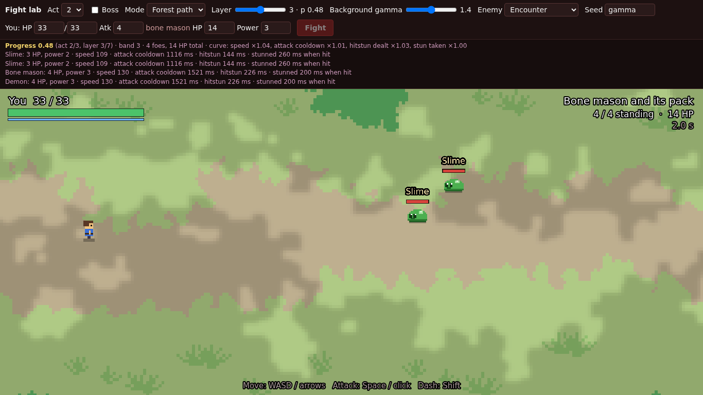
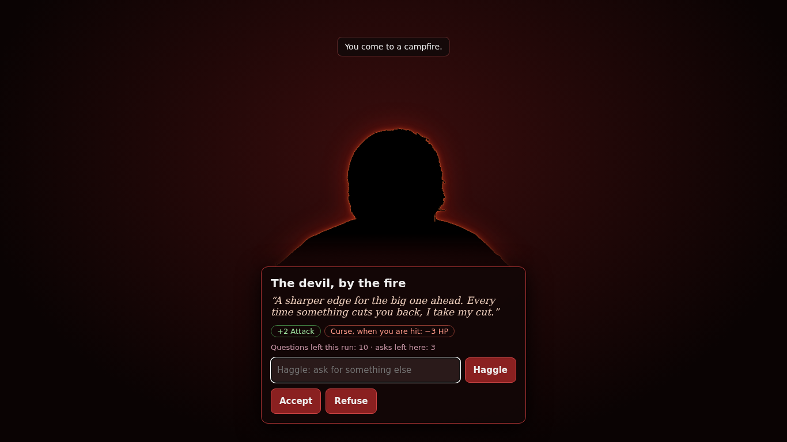
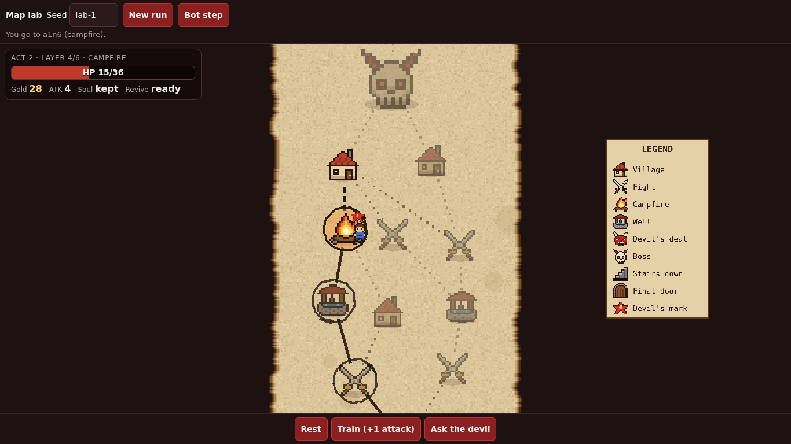

<!--
IMAGES (all relative to this file). Exist now: img/forest-fight.png (public in the repo, docs/screenshots/forest-fight.png, a Fight-lab capture with the debug bar), img/devil-offer-desk.png (local only, from art1/; the devil shown is the offline stub on a placeholder silhouette), img/map-rewritten.png (local only, from map/desktop-09-rewritten.png; Map lab capture, red star = Devil's mark). Not made: no logo, no team photo.
Timing: PITCH.md section 1, 12 + 13 + 60 + 25 + 10 s = 2:00. Slides 1-2 = hook (0:00-0:12), slide 3 = problem and fun (0:12-0:25), slide 6 = demo (0:25-1:25), slides 4-5 = tech (1:25-1:50), slides 7-9 = next and close (1:50-2:00).
Order note: the script puts the demo BEFORE the tech beat. If you present slides in order 4, 5 then 6, the clock drifts. Either present 6 first (skip ahead) or use the deck as the 3-minute version. [check: which order T wants]
-->

# A DEAL with the DEVIL

**He wants your soul. He is allowed to cheat.**

Team Spin 2 Win · StormHacks 2026

<!--
0:00 Hook (12 s), part 1.
"Roguelikes give you random loot. We give you a liar. This is A Deal with the Devil."
Say "a language model", not "Gemini", unless the live Gemini backend is confirmed [check].
-->

---

## Every shop is a menu.

# Ours is a **liar**.

*Press "buy." Nothing to read. Nothing to outsmart.*

<!--
0:00 Hook, part 2, then 0:12 Problem and fun (13 s).
"At your campfires and your wells, a devil sits down and makes you an offer. He is a language model. He wants your soul. And he is allowed to cheat.
In most games a shop is a menu. Press buy. Nothing to read, nothing to outsmart."
-->

---

## How it plays

- **3 acts**, one map each
- Realtime **forest fights**
- **Campfire:** rest, sharpen, or *the devil*
- Deals pay **now**, cost **later**

<!--
0:12 Problem and fun, continued.
"Here you talk to him. Type anything. He answers in his own words. Every deal looks good. The cost is in the fine print. Your job is to find it."
Facts: 30 HP, 10 gold, attack 3, 1 soul at the start. Slay-the-Spire style map. Fights: move, swing, dash. A run is 3 acts; die with the soul and you revive once; reach the final door with no soul and you get the hell ending.
Image: img/forest-fight.png is a Fight-lab capture (debug bar on top), act 2 in the lab. Public in the repo. Crop or swap for a play.html capture (play/desktop-05-fight.png, local only) if you want a cleaner shot.
Say it as a feature: at a campfire you pick the devil OR the fire.
-->

---

## The devil

# The LLM **proposes**.
# The engine **decides**.

- Opens with an offer for *your* weakest stat
- Can **rewrite the map** ahead of you
- Runs on **any OpenAI-compatible model**

<!--
1:25 Tech (first half), but this is the slide that explains the demo.
"The model only proposes a deal as JSON. Our code clamps every number and drops unknown fields. A strike can take at most eight health. He can never take your soul unless you say yes."
Wording rule: say the LLM devil "runs on any OpenAI-compatible model" (docs/devil-api.md, npm run devil:oai, default local gemma4:26b). Do NOT say the Gemini devil works live. Gemini behaviour, latency and cost are unmeasured. [check: is a Gemini backend deployed and verified?]
Opener is free (costs no question). Per run: 10 questions, 3 per devil node.
Image img/devil-offer-desk.png is local only; the devil in it is the offline stub on placeholder art. The stub text in the shot is canned. Do not call it AI output.
-->

---

## Under the hood

- **Stateless engine:** one JSON state, one pure `step()`
- **Frozen JSON contract**
- **Red-team:** 75 jailbreak texts
- **286 tests** [check]

<!--
1:25 Tech under the hood (25 s). Land this by 1:50.
"The game is a pure state machine. Bad faith can end a run. It can never crash the game.
286 tests. 700 recorded runs replay exactly. We attacked local models with 75 jailbreak texts. The bigger one stayed angry on all 51 hostile ones. The smaller one tried to pay out seven times. Our limits held every time."
Numbers (from llm-devil/redteam/REPORT.md, local gemma4 models, NOT Gemini): gemma4:26b angry and in character on 51/51 hostile texts, 0 leaks, 0 generous offers. gemma4:e4b obeyed injections: its raw reply tried to pay out on 7 hostile rows. sanitizeDeal stopped every forced payout; gold is capped at +30 per deal, strike at 8 HP.
Caveat to avoid overclaiming: "limits held" means the clamps held, offer quality is not guarded (a 100-gold deal in the raw reply would be cut to the cap, not refused).
[check] 286 tests: counted on e7e879c; origin/main is now at bdf6b8f (devil:oai added), so re-run npm test before quoting.
[check] Red-team run was on 6e6de17, not re-run on the current build.
If running long, cut the last sentence of this beat first.
-->

---

## Demo

1. Village → **map** → fight
2. Campfire → **Deal**
3. **Try to jailbreak him**
4. Haggle → he **rewrites the map**

<!--
0:25 Live demo (60 s). Full click path with exact stub replies: PITCH.md section 2.
0:25 village, 0:31 map, 0:36 fight (15 s max), 0:51 forced map + campfire, 0:58 Deal and the free opener, 1:05 type the jailbreak and Haggle, 1:13 type "a fire to rest at" and Haggle, 1:17 Accept, 1:21 point at the red Devil's mark.
Seed: /play.html?seed=demo, reload fresh before every take.
Runs on a TEST build (npm run game): play.html is not in npm run build yet. [check: build:game and preview:game on the demo machine; swap index.html before any public link]
Live devil URL, network and latency: [check]. Fallback: Tab B, the offline stub, same URL without VITE_DEVIL_URL.
If running long, drop the jailbreak step first.
Image img/map-rewritten.png is a Map-lab capture (act 2, local only); the red star on the campfire is the Devil's mark. For the real beat, use the live demo.
-->

---

## What's next

- Real **art** and sound
- **Bets** with real stakes
- **Longer contracts**
- Same attacks on **Gemini** [check]
- Public build = the **play page** [check]

<!--
1:50 What is next (10 s).
"Next: real art, bets with stakes, longer-lasting contracts, and the same attacks on Gemini."
Honest gaps if asked: the final build still ships the older DOM UI (play.html is test-build only); no save or resume; campfires and wells are panels, not walkable scenes; no audio; all LLM measurements are on local gemma4, not Gemini.
Drop the last two bullets from the slide if the swap and Gemini run happen before the pitch.
-->

---

## Team Spin 2 Win

- **kbph / Kirstin:** backend + the devil
- **Big Chungus / Armand:** design + art
- **legilles:** [check role]
- **T:** pitch + build / deploy

<!--
Roles from QA.md Q8: Kirstin (kbph) owns the backend, the devil integration and the repo and set most design calls. Armand (Big Chungus) is the designer: game loop, realtime fight, scene model, enemies, map layout rules. legilles gave the campfire "Rest or Train, choose one" rule; full role unknown [check, ask T]. T pitches, builds and deploys.
Commit split (103 of 111 from T's account) is in QA.md; do not put it on a slide. [check: whether to say it]
"Big Chungus" may be a handle the team wants kept off a projector. [check]
Art: the designer's devil poses are in assets/ in the repo; most other visuals are placeholders drawn in code, and the pitch should not call them final.
-->

---

# Come sell us your **soul.**

Spin 2 Win · *A DEAL with the DEVIL*

Repo: [check: public URL] · Play link: [check]

<!--
1:50-2:00. "We are Spin 2 Win. Come sell us your soul." Stop at 2:00. Then take questions: QA.md has 12 judge questions and spare answers.
Fill in the repo and play links only once the public build is swapped to the play page.
-->
